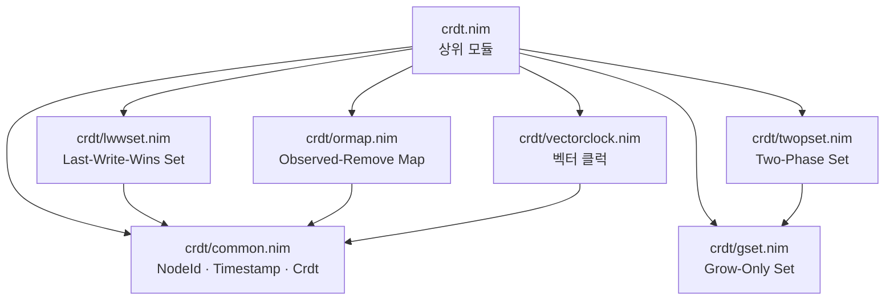

# crdt-nim

Nim 으로 구현한 수렴 복제 자료구조(CRDT) 라이브러리.

네트워크가 끊기거나 늦어지거나 메시지 순서가 뒤바뀌어도 모든 복제본이 같은 상태에
이르는 자료구조 모음이다. 모든 병합은 교환법칙·결합법칙·멱등법칙을 만족하므로
상태를 주고받은 순서와 횟수가 결과에 영향을 주지 않는다.

영어 문서가 정본이며 [README.md](./README.md) 에 있다.

## 지원하는 CRDT

| 모듈 | 설명 | 삭제 후 재추가 |
|---|---|---|
| `crdt/gset` | 추가만 가능한 집합. 합집합으로 병합 | 불가 |
| `crdt/twopset` | 추가 집합과 제거 집합을 함께 두는 집합 | 불가 |
| `crdt/lwwset` | 원소마다 마지막 갱신 시각을 두는 집합 | 가능 |
| `crdt/ormap` | 키마다 고유 ID 를 가진 항목을 두는 맵 | 가능 |
| `crdt/vectorclock` | 인과 관계를 추적하고 동시성을 감지하는 벡터 클럭 | – |

## 모듈 배치



`crdt/common.nim` 에 모든 모듈이 공유하는 낱말과 `Crdt` 개념(병합·mergeInto·동등
비교)이 있다. `crdt.nim` 이 라이브러리 전체를 재수출하므로 `import crdt` 한 줄이면
충분하고, `import crdt/gset` 은 모듈 하나만 가져온다.

## 병합 규칙

| 타입 | 병합 |
|---|---|
| G-Set | `A ∪ B` |
| 2P-Set | `(A1 ∪ A2, R1 ∪ R2)` |
| LWW-Set | 원소마다 더 나중 타임스탬프를 채택. 같으면 제거가 이긴다 |
| OR-Map | 항목과 tombstone 을 각각 합집합 |
| 벡터 클럭 | 노드마다 `max(A[n], B[n])` |

## 수렴하는 까닭

CRDT 는 Shapiro 등이 2007 년에 제안했다. 상태 공간을 반격자(join-semilattice)로
만들어 병합이 최소 상한(least upper bound)을 계산하도록 하는 것이 핵심이다.
그러려면 세 가지 성질이 필요하고, 테스트가 검사하는 것도 이 세 가지다.

1. **교환법칙** — `a ⊕ b = b ⊕ a`
2. **결합법칙** — `(a ⊕ b) ⊕ c = a ⊕ (b ⊕ c)`
3. **멱등법칙** — `a ⊕ a = a`

세 가지가 성립하면 메시지가 늦거나 순서가 뒤바뀌거나 다시 전송되어도 복제본이
수렴한다. 합집합은 세 성질을 그대로 만족하고, 타임스탬프와 `max` 규칙은 최댓값
계산으로 줄어들어 마찬가지다.

## 사용법

사용 예는 검사 절차에서 함께 컴파일·실행되는 테스트에 있다.

| 파일 | 보여 주는 것 |
|---|---|
| `tests/test_gset.nim` | 추가·포함·병합, 복제본 세 개의 수렴 |
| `tests/test_twopset.nim` | 영구 제거, 추가보다 먼저 도착한 제거 |
| `tests/test_lwwset.nim` | 타임스탬프 순서, 삭제 후 재추가, 같으면 제거 우선 |
| `tests/test_ormap.nim` | 한 키에 여러 값, 관찰 기반 제거, 병합 뒤 ID 발급 |
| `tests/test_vectorclock.nim` | tick, 인과 관계, 동시성, 병합 |
| `tests/test_concept.nim` | `Crdt` 를 통과하는 일반 절차 하나로 다섯 타입 전부 |

## 설치와 테스트

```bash
nimble install crdt
```

```bash
nimble test
# 또는
nim c -r tests/test_all.nim
```

Nim 2.0 이상이 필요하다.

## 보안 고려

- **입력 검증**: 외부 입력은 병합 전에 크기·타입·인코딩을 검증해야 한다.
- **타임스탬프**: LWW 순서는 시계를 믿는 만큼만 믿을 수 있다. 신뢰할 수 있는 출처에서 발급하고, 상한 검사로 먼 미래의 타임스탬프를 막아야 한다.
- **NodeId**: 인증된 노드만 자기 이름으로 값을 발행할 수 있어야 한다.
- **메모리**: tombstone 과 제거된 항목은 줄어들지 않는다. 오래 도는 복제본에는 이들을 걷어내는 정책이 필요하다.

## 라이선스

MIT
