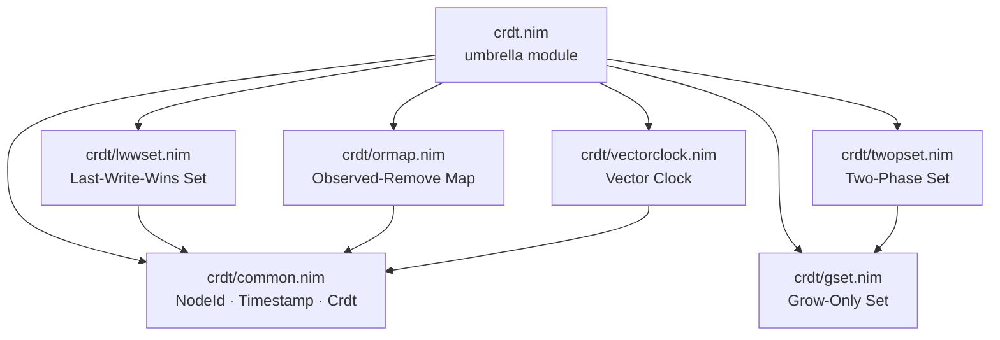

# crdt-nim

Conflict-free Replicated Data Types for Nim.

Data structures that reach the same state on every replica even when the network
drops, delays, or reorders messages. Every merge is commutative, associative and
idempotent, so the result does not depend on the order or the number of times
replicas exchange state.

한국어 문서는 [README.ko.md](./README.ko.md) 에 있다. This file is the source of truth.

## Supported CRDTs

| Module | Description | Remove then re-add |
|---|---|---|
| `crdt/gset` | Grow-Only Set. Merges by union | No |
| `crdt/twopset` | Two-Phase Set. An add set and a remove set | No |
| `crdt/lwwset` | Last-Write-Wins Set. Ordered by timestamp | Yes |
| `crdt/ormap` | Observed-Remove Map. Each key holds uniquely identified entries | Yes |
| `crdt/vectorclock` | Vector Clock. Tracks causality, detects concurrency | – |

## Module layout



`crdt/common.nim` holds the vocabulary every module shares and the `Crdt`
concept — merge, mergeInto and equality. `crdt.nim` re-exports the whole
library, so `import crdt` is enough; `import crdt/gset` pulls in a single module.

## Merge rules

| Type | Merge |
|---|---|
| G-Set | `A ∪ B` |
| 2P-Set | `(A1 ∪ A2, R1 ∪ R2)` |
| LWW-Set | Keep the larger timestamp per element. A tie goes to removal |
| OR-Map | Union of entries, union of tombstones |
| Vector Clock | `max(A[n], B[n])` per node |

## Why it converges

CRDTs were proposed by Shapiro et al. in 2007. The idea is to shape the state
space as a join-semilattice, so that a merge computes a least upper bound. That
needs three properties, and they are what the test suite checks:

1. **Commutativity** — `a ⊕ b = b ⊕ a`
2. **Associativity** — `(a ⊕ b) ⊕ c = a ⊕ (b ⊕ c)`
3. **Idempotency** — `a ⊕ a = a`

Hold all three and replicas converge no matter how messages are delayed,
reordered or retransmitted. Union satisfies them outright; the timestamp and
`max` rules reduce to taking a maximum, which does too.

## Usage

Worked examples live in the test suite, which is compiled and run on every push:

| File | Shows |
|---|---|
| `tests/test_gset.nim` | add, contains, merge, and a three-replica convergence run |
| `tests/test_twopset.nim` | permanent removal, and a removal that arrives before the add |
| `tests/test_lwwset.nim` | timestamp ordering, delete then re-add, delete-wins ties |
| `tests/test_ormap.nim` | multi-value keys, observed-remove, issuing IDs after a merge |
| `tests/test_vectorclock.nim` | tick, causality, concurrency, merge |
| `tests/test_concept.nim` | one generic procedure over all five types, through `Crdt` |

## Install and test

```bash
nimble install crdt
```

```bash
nimble test
# or
nim c -r tests/test_all.nim
```

Requires Nim 2.0 or newer.

## Security notes

- **Input**: validate size, type and encoding of external values before they enter a merge.
- **Timestamps**: LWW ordering is only as trustworthy as the clock behind it. Issue timestamps from a trusted source, and reject values above a bound to blunt far-future timestamps.
- **NodeId**: only an authenticated node should be able to publish under a given id.
- **Memory**: tombstones and removed entries never shrink. A long-running replica needs a policy for dropping them.

## License

MIT
